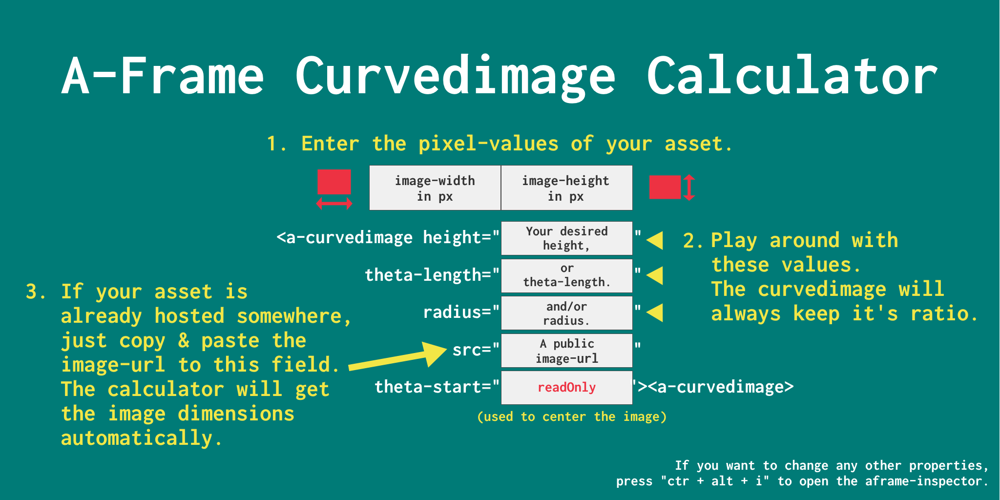

## Curvedimage Calculator

The Curvedimage Calculator is a Helper App for A-Frames <a href="https://aframe.io/docs/0.5.0/primitives/a-curvedimage.html" target="blank">&lt;a-curvedimage&gt; component</a>.

It will help you to safely adjust the height, radius and theta-length attributes based on the image ratio of the asset you're planning to use without distorting or stretching the image.

# Use the Curvedimage Calculator locally

1. download or clone this repository
2. cd aframe-curvedimage-calculator
3. npm install
4. npm run calculator

The calculator will be served on http://localhost:8090/
